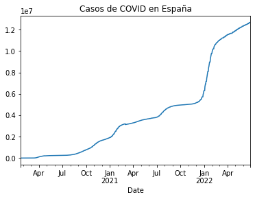
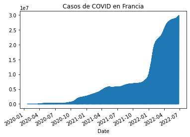
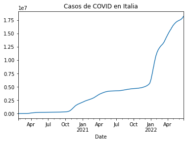
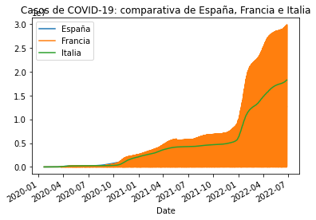
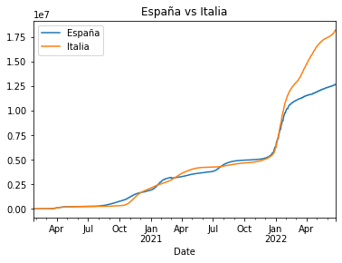

La url utilizada será https://api.covid19api.com/countries

Instalamos las librerías.


```python
!pip install pandas
```

    Requirement already satisfied: pandas in /usr/local/lib/python3.8/dist-packages (1.3.1)
    Requirement already satisfied: numpy>=1.17.3 in /usr/local/lib/python3.8/dist-packages (from pandas) (1.21.1)
    Requirement already satisfied: pytz>=2017.3 in /usr/local/lib/python3.8/dist-packages (from pandas) (2020.4)
    Requirement already satisfied: python-dateutil>=2.7.3 in /usr/local/lib/python3.8/dist-packages (from pandas) (2.8.1)
    Requirement already satisfied: six>=1.5 in /usr/lib/python3/dist-packages (from python-dateutil>=2.7.3->pandas) (1.14.0)


Ya estaban instaladas pero así se ve el proceso. Ahora se importarían. 


```python
import pandas as pd
```

Definimos la url 


```python
url = 'https://api.covid19api.com/countries'
```


```python
url
```


    'https://api.covid19api.com/countries'


Creamos el dataframe. 


```python
df = pd.read_json(url)
```


```python
df
```


<div>
<style scoped>
    .dataframe tbody tr th:only-of-type {
        vertical-align: middle;
    }

    .dataframe tbody tr th {
        vertical-align: top;
    }

    .dataframe thead th {
        text-align: right;
    }
</style>
<table border="1" class="dataframe">
  <thead>
    <tr style="text-align: right;">
      <th></th>
      <th>Country</th>
      <th>Slug</th>
      <th>ISO2</th>
    </tr>
  </thead>
  <tbody>
    <tr>
      <th>0</th>
      <td>Falkland Islands (Malvinas)</td>
      <td>falkland-islands-malvinas</td>
      <td>FK</td>
    </tr>
    <tr>
      <th>1</th>
      <td>Panama</td>
      <td>panama</td>
      <td>PA</td>
    </tr>
    <tr>
      <th>2</th>
      <td>Russian Federation</td>
      <td>russia</td>
      <td>RU</td>
    </tr>
    <tr>
      <th>3</th>
      <td>Turkmenistan</td>
      <td>turkmenistan</td>
      <td>TM</td>
    </tr>
    <tr>
      <th>4</th>
      <td>Guinea</td>
      <td>guinea</td>
      <td>GN</td>
    </tr>
    <tr>
      <th>...</th>
      <td>...</td>
      <td>...</td>
      <td>...</td>
    </tr>
    <tr>
      <th>243</th>
      <td>Guyana</td>
      <td>guyana</td>
      <td>GY</td>
    </tr>
    <tr>
      <th>244</th>
      <td>Hungary</td>
      <td>hungary</td>
      <td>HU</td>
    </tr>
    <tr>
      <th>245</th>
      <td>Kazakhstan</td>
      <td>kazakhstan</td>
      <td>KZ</td>
    </tr>
    <tr>
      <th>246</th>
      <td>Liberia</td>
      <td>liberia</td>
      <td>LR</td>
    </tr>
    <tr>
      <th>247</th>
      <td>Somalia</td>
      <td>somalia</td>
      <td>SO</td>
    </tr>
  </tbody>
</table>
<p>248 rows × 3 columns</p>
</div>


Así se ven solo los primeros: 


```python
df.head
```


    <bound method NDFrame.head of                          Country                       Slug ISO2
    0    Falkland Islands (Malvinas)  falkland-islands-malvinas   FK
    1                         Panama                     panama   PA
    2             Russian Federation                     russia   RU
    3                   Turkmenistan               turkmenistan   TM
    4                         Guinea                     guinea   GN
    ..                           ...                        ...  ...
    243                       Guyana                     guyana   GY
    244                      Hungary                    hungary   HU
    245                   Kazakhstan                 kazakhstan   KZ
    246                      Liberia                    liberia   LR
    247                      Somalia                    somalia   SO
    
    [248 rows x 3 columns]>


Así los últimos:


```python
df.tail
```


    <bound method NDFrame.tail of                          Country                       Slug ISO2
    0    Falkland Islands (Malvinas)  falkland-islands-malvinas   FK
    1                         Panama                     panama   PA
    2             Russian Federation                     russia   RU
    3                   Turkmenistan               turkmenistan   TM
    4                         Guinea                     guinea   GN
    ..                           ...                        ...  ...
    243                       Guyana                     guyana   GY
    244                      Hungary                    hungary   HU
    245                   Kazakhstan                 kazakhstan   KZ
    246                      Liberia                    liberia   LR
    247                      Somalia                    somalia   SO
    
    [248 rows x 3 columns]>


Desglosamos las columnas:


```python
df.columns
```


    Index(['Country', 'Slug', 'ISO2'], dtype='object')


```python
df.info()
```

    <class 'pandas.core.frame.DataFrame'>
    RangeIndex: 248 entries, 0 to 247
    Data columns (total 3 columns):
     #   Column   Non-Null Count  Dtype 
    ---  ------   --------------  ----- 
     0   Country  248 non-null    object
     1   Slug     248 non-null    object
     2   ISO2     248 non-null    object
    dtypes: object(3)
    memory usage: 5.9+ KB


```python
df.set_index('Country')
```


<div>
<style scoped>
    .dataframe tbody tr th:only-of-type {
        vertical-align: middle;
    }

    .dataframe tbody tr th {
        vertical-align: top;
    }

    .dataframe thead th {
        text-align: right;
    }
</style>
<table border="1" class="dataframe">
  <thead>
    <tr style="text-align: right;">
      <th></th>
      <th>Slug</th>
      <th>ISO2</th>
    </tr>
    <tr>
      <th>Country</th>
      <th></th>
      <th></th>
    </tr>
  </thead>
  <tbody>
    <tr>
      <th>Falkland Islands (Malvinas)</th>
      <td>falkland-islands-malvinas</td>
      <td>FK</td>
    </tr>
    <tr>
      <th>Panama</th>
      <td>panama</td>
      <td>PA</td>
    </tr>
    <tr>
      <th>Russian Federation</th>
      <td>russia</td>
      <td>RU</td>
    </tr>
    <tr>
      <th>Turkmenistan</th>
      <td>turkmenistan</td>
      <td>TM</td>
    </tr>
    <tr>
      <th>Guinea</th>
      <td>guinea</td>
      <td>GN</td>
    </tr>
    <tr>
      <th>...</th>
      <td>...</td>
      <td>...</td>
    </tr>
    <tr>
      <th>Guyana</th>
      <td>guyana</td>
      <td>GY</td>
    </tr>
    <tr>
      <th>Hungary</th>
      <td>hungary</td>
      <td>HU</td>
    </tr>
    <tr>
      <th>Kazakhstan</th>
      <td>kazakhstan</td>
      <td>KZ</td>
    </tr>
    <tr>
      <th>Liberia</th>
      <td>liberia</td>
      <td>LR</td>
    </tr>
    <tr>
      <th>Somalia</th>
      <td>somalia</td>
      <td>SO</td>
    </tr>
  </tbody>
</table>
<p>248 rows × 2 columns</p>
</div>


Vamos a ver los datos de algunos países (España, Francia e Italia) en tiempo real. 


```python
url_es = 'https://api.covid19api.com/country/spain/status/confirmed/live'
```


```python
url_fr = 'https://api.covid19api.com/country/france/status/confirmed/live'
```


```python
url_it = 'https://api.covid19api.com/country/italy/status/confirmed/live'
```


```python
df_es = pd.read_json(url_es)
df_fr = pd.read_json(url_fr)
df_it = pd.read_json(url_it)
```


```python
df_es
```


<div>
<style scoped>
    .dataframe tbody tr th:only-of-type {
        vertical-align: middle;
    }

    .dataframe tbody tr th {
        vertical-align: top;
    }

    .dataframe thead th {
        text-align: right;
    }
</style>
<table border="1" class="dataframe">
  <thead>
    <tr style="text-align: right;">
      <th></th>
      <th>Country</th>
      <th>CountryCode</th>
      <th>Province</th>
      <th>City</th>
      <th>CityCode</th>
      <th>Lat</th>
      <th>Lon</th>
      <th>Cases</th>
      <th>Status</th>
      <th>Date</th>
    </tr>
  </thead>
  <tbody>
    <tr>
      <th>0</th>
      <td>Spain</td>
      <td>ES</td>
      <td></td>
      <td></td>
      <td></td>
      <td>40.46</td>
      <td>-3.75</td>
      <td>0</td>
      <td>confirmed</td>
      <td>2020-01-22 00:00:00+00:00</td>
    </tr>
    <tr>
      <th>1</th>
      <td>Spain</td>
      <td>ES</td>
      <td></td>
      <td></td>
      <td></td>
      <td>40.46</td>
      <td>-3.75</td>
      <td>0</td>
      <td>confirmed</td>
      <td>2020-01-23 00:00:00+00:00</td>
    </tr>
    <tr>
      <th>2</th>
      <td>Spain</td>
      <td>ES</td>
      <td></td>
      <td></td>
      <td></td>
      <td>40.46</td>
      <td>-3.75</td>
      <td>0</td>
      <td>confirmed</td>
      <td>2020-01-24 00:00:00+00:00</td>
    </tr>
    <tr>
      <th>3</th>
      <td>Spain</td>
      <td>ES</td>
      <td></td>
      <td></td>
      <td></td>
      <td>40.46</td>
      <td>-3.75</td>
      <td>0</td>
      <td>confirmed</td>
      <td>2020-01-25 00:00:00+00:00</td>
    </tr>
    <tr>
      <th>4</th>
      <td>Spain</td>
      <td>ES</td>
      <td></td>
      <td></td>
      <td></td>
      <td>40.46</td>
      <td>-3.75</td>
      <td>0</td>
      <td>confirmed</td>
      <td>2020-01-26 00:00:00+00:00</td>
    </tr>
    <tr>
      <th>...</th>
      <td>...</td>
      <td>...</td>
      <td>...</td>
      <td>...</td>
      <td>...</td>
      <td>...</td>
      <td>...</td>
      <td>...</td>
      <td>...</td>
      <td>...</td>
    </tr>
    <tr>
      <th>883</th>
      <td>Spain</td>
      <td>ES</td>
      <td></td>
      <td></td>
      <td></td>
      <td>40.46</td>
      <td>-3.75</td>
      <td>12613634</td>
      <td>confirmed</td>
      <td>2022-06-23 00:00:00+00:00</td>
    </tr>
    <tr>
      <th>884</th>
      <td>Spain</td>
      <td>ES</td>
      <td></td>
      <td></td>
      <td></td>
      <td>40.46</td>
      <td>-3.75</td>
      <td>12681820</td>
      <td>confirmed</td>
      <td>2022-06-24 00:00:00+00:00</td>
    </tr>
    <tr>
      <th>885</th>
      <td>Spain</td>
      <td>ES</td>
      <td></td>
      <td></td>
      <td></td>
      <td>40.46</td>
      <td>-3.75</td>
      <td>12681820</td>
      <td>confirmed</td>
      <td>2022-06-25 00:00:00+00:00</td>
    </tr>
    <tr>
      <th>886</th>
      <td>Spain</td>
      <td>ES</td>
      <td></td>
      <td></td>
      <td></td>
      <td>40.46</td>
      <td>-3.75</td>
      <td>12681820</td>
      <td>confirmed</td>
      <td>2022-06-26 00:00:00+00:00</td>
    </tr>
    <tr>
      <th>887</th>
      <td>Spain</td>
      <td>ES</td>
      <td></td>
      <td></td>
      <td></td>
      <td>40.46</td>
      <td>-3.75</td>
      <td>12681820</td>
      <td>confirmed</td>
      <td>2022-06-27 00:00:00+00:00</td>
    </tr>
  </tbody>
</table>
<p>888 rows × 10 columns</p>
</div>


```python
df_fr
```


<div>
<style scoped>
    .dataframe tbody tr th:only-of-type {
        vertical-align: middle;
    }

    .dataframe tbody tr th {
        vertical-align: top;
    }

    .dataframe thead th {
        text-align: right;
    }
</style>
<table border="1" class="dataframe">
  <thead>
    <tr style="text-align: right;">
      <th></th>
      <th>Country</th>
      <th>CountryCode</th>
      <th>Province</th>
      <th>City</th>
      <th>CityCode</th>
      <th>Lat</th>
      <th>Lon</th>
      <th>Cases</th>
      <th>Status</th>
      <th>Date</th>
    </tr>
  </thead>
  <tbody>
    <tr>
      <th>0</th>
      <td>France</td>
      <td>FR</td>
      <td>Martinique</td>
      <td></td>
      <td></td>
      <td>14.64</td>
      <td>-61.02</td>
      <td>0</td>
      <td>confirmed</td>
      <td>2020-01-22 00:00:00+00:00</td>
    </tr>
    <tr>
      <th>1</th>
      <td>France</td>
      <td>FR</td>
      <td>New Caledonia</td>
      <td></td>
      <td></td>
      <td>-20.90</td>
      <td>165.62</td>
      <td>0</td>
      <td>confirmed</td>
      <td>2020-01-22 00:00:00+00:00</td>
    </tr>
    <tr>
      <th>2</th>
      <td>France</td>
      <td>FR</td>
      <td>Reunion</td>
      <td></td>
      <td></td>
      <td>-21.12</td>
      <td>55.54</td>
      <td>0</td>
      <td>confirmed</td>
      <td>2020-01-22 00:00:00+00:00</td>
    </tr>
    <tr>
      <th>3</th>
      <td>France</td>
      <td>FR</td>
      <td>Wallis and Futuna</td>
      <td></td>
      <td></td>
      <td>-14.29</td>
      <td>-178.12</td>
      <td>0</td>
      <td>confirmed</td>
      <td>2020-01-22 00:00:00+00:00</td>
    </tr>
    <tr>
      <th>4</th>
      <td>France</td>
      <td>FR</td>
      <td>French Guiana</td>
      <td></td>
      <td></td>
      <td>4.00</td>
      <td>-53.00</td>
      <td>0</td>
      <td>confirmed</td>
      <td>2020-01-22 00:00:00+00:00</td>
    </tr>
    <tr>
      <th>...</th>
      <td>...</td>
      <td>...</td>
      <td>...</td>
      <td>...</td>
      <td>...</td>
      <td>...</td>
      <td>...</td>
      <td>...</td>
      <td>...</td>
      <td>...</td>
    </tr>
    <tr>
      <th>10652</th>
      <td>France</td>
      <td>FR</td>
      <td>Mayotte</td>
      <td></td>
      <td></td>
      <td>-12.83</td>
      <td>45.17</td>
      <td>37877</td>
      <td>confirmed</td>
      <td>2022-06-27 00:00:00+00:00</td>
    </tr>
    <tr>
      <th>10653</th>
      <td>France</td>
      <td>FR</td>
      <td>Saint Barthelemy</td>
      <td></td>
      <td></td>
      <td>17.90</td>
      <td>-62.83</td>
      <td>4671</td>
      <td>confirmed</td>
      <td>2022-06-27 00:00:00+00:00</td>
    </tr>
    <tr>
      <th>10654</th>
      <td>France</td>
      <td>FR</td>
      <td>French Guiana</td>
      <td></td>
      <td></td>
      <td>3.93</td>
      <td>-53.13</td>
      <td>85596</td>
      <td>confirmed</td>
      <td>2022-06-27 00:00:00+00:00</td>
    </tr>
    <tr>
      <th>10655</th>
      <td>France</td>
      <td>FR</td>
      <td>Reunion</td>
      <td></td>
      <td></td>
      <td>-21.12</td>
      <td>55.54</td>
      <td>421269</td>
      <td>confirmed</td>
      <td>2022-06-27 00:00:00+00:00</td>
    </tr>
    <tr>
      <th>10656</th>
      <td>France</td>
      <td>FR</td>
      <td></td>
      <td></td>
      <td></td>
      <td>46.23</td>
      <td>2.21</td>
      <td>29823387</td>
      <td>confirmed</td>
      <td>2022-06-28 00:00:00+00:00</td>
    </tr>
  </tbody>
</table>
<p>10657 rows × 10 columns</p>
</div>


```python
df_it
```


<div>
<style scoped>
    .dataframe tbody tr th:only-of-type {
        vertical-align: middle;
    }

    .dataframe tbody tr th {
        vertical-align: top;
    }

    .dataframe thead th {
        text-align: right;
    }
</style>
<table border="1" class="dataframe">
  <thead>
    <tr style="text-align: right;">
      <th></th>
      <th>Country</th>
      <th>CountryCode</th>
      <th>Province</th>
      <th>City</th>
      <th>CityCode</th>
      <th>Lat</th>
      <th>Lon</th>
      <th>Cases</th>
      <th>Status</th>
      <th>Date</th>
    </tr>
  </thead>
  <tbody>
    <tr>
      <th>0</th>
      <td>Italy</td>
      <td>IT</td>
      <td></td>
      <td></td>
      <td></td>
      <td>41.87</td>
      <td>12.57</td>
      <td>0</td>
      <td>confirmed</td>
      <td>2020-01-22 00:00:00+00:00</td>
    </tr>
    <tr>
      <th>1</th>
      <td>Italy</td>
      <td>IT</td>
      <td></td>
      <td></td>
      <td></td>
      <td>41.87</td>
      <td>12.57</td>
      <td>0</td>
      <td>confirmed</td>
      <td>2020-01-23 00:00:00+00:00</td>
    </tr>
    <tr>
      <th>2</th>
      <td>Italy</td>
      <td>IT</td>
      <td></td>
      <td></td>
      <td></td>
      <td>41.87</td>
      <td>12.57</td>
      <td>0</td>
      <td>confirmed</td>
      <td>2020-01-24 00:00:00+00:00</td>
    </tr>
    <tr>
      <th>3</th>
      <td>Italy</td>
      <td>IT</td>
      <td></td>
      <td></td>
      <td></td>
      <td>41.87</td>
      <td>12.57</td>
      <td>0</td>
      <td>confirmed</td>
      <td>2020-01-25 00:00:00+00:00</td>
    </tr>
    <tr>
      <th>4</th>
      <td>Italy</td>
      <td>IT</td>
      <td></td>
      <td></td>
      <td></td>
      <td>41.87</td>
      <td>12.57</td>
      <td>0</td>
      <td>confirmed</td>
      <td>2020-01-26 00:00:00+00:00</td>
    </tr>
    <tr>
      <th>...</th>
      <td>...</td>
      <td>...</td>
      <td>...</td>
      <td>...</td>
      <td>...</td>
      <td>...</td>
      <td>...</td>
      <td>...</td>
      <td>...</td>
      <td>...</td>
    </tr>
    <tr>
      <th>883</th>
      <td>Italy</td>
      <td>IT</td>
      <td></td>
      <td></td>
      <td></td>
      <td>41.87</td>
      <td>12.57</td>
      <td>18071634</td>
      <td>confirmed</td>
      <td>2022-06-23 00:00:00+00:00</td>
    </tr>
    <tr>
      <th>884</th>
      <td>Italy</td>
      <td>IT</td>
      <td></td>
      <td></td>
      <td></td>
      <td>41.87</td>
      <td>12.57</td>
      <td>18128044</td>
      <td>confirmed</td>
      <td>2022-06-24 00:00:00+00:00</td>
    </tr>
    <tr>
      <th>885</th>
      <td>Italy</td>
      <td>IT</td>
      <td></td>
      <td></td>
      <td></td>
      <td>41.87</td>
      <td>12.57</td>
      <td>18184917</td>
      <td>confirmed</td>
      <td>2022-06-25 00:00:00+00:00</td>
    </tr>
    <tr>
      <th>886</th>
      <td>Italy</td>
      <td>IT</td>
      <td></td>
      <td></td>
      <td></td>
      <td>41.87</td>
      <td>12.57</td>
      <td>18234242</td>
      <td>confirmed</td>
      <td>2022-06-26 00:00:00+00:00</td>
    </tr>
    <tr>
      <th>887</th>
      <td>Italy</td>
      <td>IT</td>
      <td></td>
      <td></td>
      <td></td>
      <td>41.87</td>
      <td>12.57</td>
      <td>18259261</td>
      <td>confirmed</td>
      <td>2022-06-27 00:00:00+00:00</td>
    </tr>
  </tbody>
</table>
<p>888 rows × 10 columns</p>
</div>


Vamos a acotarlo para ver solo los casos por fecha y se entienda mejor la tabla


```python
df_es.set_index('Date')['Cases']
```


    Date
    2020-01-22 00:00:00+00:00           0
    2020-01-23 00:00:00+00:00           0
    2020-01-24 00:00:00+00:00           0
    2020-01-25 00:00:00+00:00           0
    2020-01-26 00:00:00+00:00           0
                                   ...   
    2022-06-23 00:00:00+00:00    12613634
    2022-06-24 00:00:00+00:00    12681820
    2022-06-25 00:00:00+00:00    12681820
    2022-06-26 00:00:00+00:00    12681820
    2022-06-27 00:00:00+00:00    12681820
    Name: Cases, Length: 888, dtype: int64


En gráfico lo veremos mejor...


```python
df_es.set_index('Date')['Cases'].plot(title='Casos de COVID en España')
```


    <AxesSubplot:title={'center':'Casos de COVID en España'}, xlabel='Date'>





Según este gráfico los datos han crecido considerablemente. Podemos interpretar que a pesar de haber más casos gracias a la inmunización los soportamos mejor y no hay tantas muertes. 


```python
df_fr.set_index('Date')['Cases'].plot(title='Casos de COVID en Francia')
```


    <AxesSubplot:title={'center':'Casos de COVID en Francia'}, xlabel='Date'>





```python
df_it.set_index('Date')['Cases'].plot(title='Casos de COVID en Italia')
```


    <AxesSubplot:title={'center':'Casos de COVID en Italia'}, xlabel='Date'>





Vamos a comparar la evolución de nuestros tres países en un solo gráfico. 


```python
casos_es = df_es.set_index('Date')['Cases']
casos_fr = df_fr.set_index('Date')['Cases']
casos_it = df_it.set_index('Date')['Cases']
```

Tras establecer estas nuevas variables, las concatenamos para después hacer el gráfico


```python
pd.concat([casos_es,casos_fr,casos_it],axis=1)
```


<div>
<style scoped>
    .dataframe tbody tr th:only-of-type {
        vertical-align: middle;
    }

    .dataframe tbody tr th {
        vertical-align: top;
    }

    .dataframe thead th {
        text-align: right;
    }
</style>
<table border="1" class="dataframe">
  <thead>
    <tr style="text-align: right;">
      <th></th>
      <th>Cases</th>
      <th>Cases</th>
      <th>Cases</th>
    </tr>
    <tr>
      <th>Date</th>
      <th></th>
      <th></th>
      <th></th>
    </tr>
  </thead>
  <tbody>
    <tr>
      <th>2020-01-22 00:00:00+00:00</th>
      <td>0.0</td>
      <td>0</td>
      <td>0.0</td>
    </tr>
    <tr>
      <th>2020-01-22 00:00:00+00:00</th>
      <td>0.0</td>
      <td>0</td>
      <td>0.0</td>
    </tr>
    <tr>
      <th>2020-01-22 00:00:00+00:00</th>
      <td>0.0</td>
      <td>0</td>
      <td>0.0</td>
    </tr>
    <tr>
      <th>2020-01-22 00:00:00+00:00</th>
      <td>0.0</td>
      <td>0</td>
      <td>0.0</td>
    </tr>
    <tr>
      <th>2020-01-22 00:00:00+00:00</th>
      <td>0.0</td>
      <td>0</td>
      <td>0.0</td>
    </tr>
    <tr>
      <th>...</th>
      <td>...</td>
      <td>...</td>
      <td>...</td>
    </tr>
    <tr>
      <th>2022-06-27 00:00:00+00:00</th>
      <td>12681820.0</td>
      <td>37877</td>
      <td>18259261.0</td>
    </tr>
    <tr>
      <th>2022-06-27 00:00:00+00:00</th>
      <td>12681820.0</td>
      <td>4671</td>
      <td>18259261.0</td>
    </tr>
    <tr>
      <th>2022-06-27 00:00:00+00:00</th>
      <td>12681820.0</td>
      <td>85596</td>
      <td>18259261.0</td>
    </tr>
    <tr>
      <th>2022-06-27 00:00:00+00:00</th>
      <td>12681820.0</td>
      <td>421269</td>
      <td>18259261.0</td>
    </tr>
    <tr>
      <th>2022-06-28 00:00:00+00:00</th>
      <td>NaN</td>
      <td>29823387</td>
      <td>NaN</td>
    </tr>
  </tbody>
</table>
<p>10657 rows × 3 columns</p>
</div>


Vamos a cambiar los nombres de las columnas a los respectivos países para poder distinguirlos tanto en la tabla como en el gráfico. 


```python
vs = pd.concat([casos_es,casos_fr,casos_it],axis=1)
```


```python
vs.columns = ['España','Francia','Italia']
```


```python
vs
```


<div>
<style scoped>
    .dataframe tbody tr th:only-of-type {
        vertical-align: middle;
    }

    .dataframe tbody tr th {
        vertical-align: top;
    }

    .dataframe thead th {
        text-align: right;
    }
</style>
<table border="1" class="dataframe">
  <thead>
    <tr style="text-align: right;">
      <th></th>
      <th>España</th>
      <th>Francia</th>
      <th>Italia</th>
    </tr>
    <tr>
      <th>Date</th>
      <th></th>
      <th></th>
      <th></th>
    </tr>
  </thead>
  <tbody>
    <tr>
      <th>2020-01-22 00:00:00+00:00</th>
      <td>0.0</td>
      <td>0</td>
      <td>0.0</td>
    </tr>
    <tr>
      <th>2020-01-22 00:00:00+00:00</th>
      <td>0.0</td>
      <td>0</td>
      <td>0.0</td>
    </tr>
    <tr>
      <th>2020-01-22 00:00:00+00:00</th>
      <td>0.0</td>
      <td>0</td>
      <td>0.0</td>
    </tr>
    <tr>
      <th>2020-01-22 00:00:00+00:00</th>
      <td>0.0</td>
      <td>0</td>
      <td>0.0</td>
    </tr>
    <tr>
      <th>2020-01-22 00:00:00+00:00</th>
      <td>0.0</td>
      <td>0</td>
      <td>0.0</td>
    </tr>
    <tr>
      <th>...</th>
      <td>...</td>
      <td>...</td>
      <td>...</td>
    </tr>
    <tr>
      <th>2022-06-27 00:00:00+00:00</th>
      <td>12681820.0</td>
      <td>37877</td>
      <td>18259261.0</td>
    </tr>
    <tr>
      <th>2022-06-27 00:00:00+00:00</th>
      <td>12681820.0</td>
      <td>4671</td>
      <td>18259261.0</td>
    </tr>
    <tr>
      <th>2022-06-27 00:00:00+00:00</th>
      <td>12681820.0</td>
      <td>85596</td>
      <td>18259261.0</td>
    </tr>
    <tr>
      <th>2022-06-27 00:00:00+00:00</th>
      <td>12681820.0</td>
      <td>421269</td>
      <td>18259261.0</td>
    </tr>
    <tr>
      <th>2022-06-28 00:00:00+00:00</th>
      <td>NaN</td>
      <td>29823387</td>
      <td>NaN</td>
    </tr>
  </tbody>
</table>
<p>10657 rows × 3 columns</p>
</div>


Y finalmente hacemos plot para visualizarlo gráficamente.


```python
vs.plot(title="Casos de COVID-19: comparativa de España, Francia e Italia")
```


    <AxesSubplot:title={'center':'Casos de COVID-19: comparativa de España, Francia e Italia'}, xlabel='Date'>





No funciona muy bien, en las operaciones siguientes probamos con españa e italia, los datos de francia deben ser el problema. El procedimiento seguido para el gráfico de 3 es correcto. 


```python
pd.concat([casos_es,casos_it],axis=1)
```


<div>
<style scoped>
    .dataframe tbody tr th:only-of-type {
        vertical-align: middle;
    }

    .dataframe tbody tr th {
        vertical-align: top;
    }

    .dataframe thead th {
        text-align: right;
    }
</style>
<table border="1" class="dataframe">
  <thead>
    <tr style="text-align: right;">
      <th></th>
      <th>Cases</th>
      <th>Cases</th>
    </tr>
    <tr>
      <th>Date</th>
      <th></th>
      <th></th>
    </tr>
  </thead>
  <tbody>
    <tr>
      <th>2020-01-22 00:00:00+00:00</th>
      <td>0</td>
      <td>0</td>
    </tr>
    <tr>
      <th>2020-01-23 00:00:00+00:00</th>
      <td>0</td>
      <td>0</td>
    </tr>
    <tr>
      <th>2020-01-24 00:00:00+00:00</th>
      <td>0</td>
      <td>0</td>
    </tr>
    <tr>
      <th>2020-01-25 00:00:00+00:00</th>
      <td>0</td>
      <td>0</td>
    </tr>
    <tr>
      <th>2020-01-26 00:00:00+00:00</th>
      <td>0</td>
      <td>0</td>
    </tr>
    <tr>
      <th>...</th>
      <td>...</td>
      <td>...</td>
    </tr>
    <tr>
      <th>2022-06-23 00:00:00+00:00</th>
      <td>12613634</td>
      <td>18071634</td>
    </tr>
    <tr>
      <th>2022-06-24 00:00:00+00:00</th>
      <td>12681820</td>
      <td>18128044</td>
    </tr>
    <tr>
      <th>2022-06-25 00:00:00+00:00</th>
      <td>12681820</td>
      <td>18184917</td>
    </tr>
    <tr>
      <th>2022-06-26 00:00:00+00:00</th>
      <td>12681820</td>
      <td>18234242</td>
    </tr>
    <tr>
      <th>2022-06-27 00:00:00+00:00</th>
      <td>12681820</td>
      <td>18259261</td>
    </tr>
  </tbody>
</table>
<p>888 rows × 2 columns</p>
</div>


```python
vs = pd.concat([casos_es,casos_it],axis=1)
```


```python
vs
```


<div>
<style scoped>
    .dataframe tbody tr th:only-of-type {
        vertical-align: middle;
    }

    .dataframe tbody tr th {
        vertical-align: top;
    }

    .dataframe thead th {
        text-align: right;
    }
</style>
<table border="1" class="dataframe">
  <thead>
    <tr style="text-align: right;">
      <th></th>
      <th>Cases</th>
      <th>Cases</th>
    </tr>
    <tr>
      <th>Date</th>
      <th></th>
      <th></th>
    </tr>
  </thead>
  <tbody>
    <tr>
      <th>2020-01-22 00:00:00+00:00</th>
      <td>0.0</td>
      <td>0</td>
    </tr>
    <tr>
      <th>2020-01-22 00:00:00+00:00</th>
      <td>0.0</td>
      <td>0</td>
    </tr>
    <tr>
      <th>2020-01-22 00:00:00+00:00</th>
      <td>0.0</td>
      <td>0</td>
    </tr>
    <tr>
      <th>2020-01-22 00:00:00+00:00</th>
      <td>0.0</td>
      <td>0</td>
    </tr>
    <tr>
      <th>2020-01-22 00:00:00+00:00</th>
      <td>0.0</td>
      <td>0</td>
    </tr>
    <tr>
      <th>...</th>
      <td>...</td>
      <td>...</td>
    </tr>
    <tr>
      <th>2022-06-27 00:00:00+00:00</th>
      <td>12681820.0</td>
      <td>37877</td>
    </tr>
    <tr>
      <th>2022-06-27 00:00:00+00:00</th>
      <td>12681820.0</td>
      <td>4671</td>
    </tr>
    <tr>
      <th>2022-06-27 00:00:00+00:00</th>
      <td>12681820.0</td>
      <td>85596</td>
    </tr>
    <tr>
      <th>2022-06-27 00:00:00+00:00</th>
      <td>12681820.0</td>
      <td>421269</td>
    </tr>
    <tr>
      <th>2022-06-28 00:00:00+00:00</th>
      <td>NaN</td>
      <td>29823387</td>
    </tr>
  </tbody>
</table>
<p>10657 rows × 2 columns</p>
</div>


```python
vs.columns = ['España','Italia']
```


```python
vs.plot(title="España vs Italia")
```


    <AxesSubplot:title={'center':'España vs Italia'}, xlabel='Date'>




